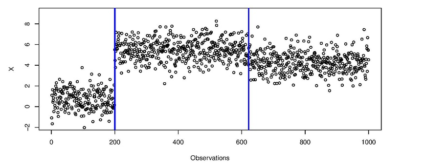
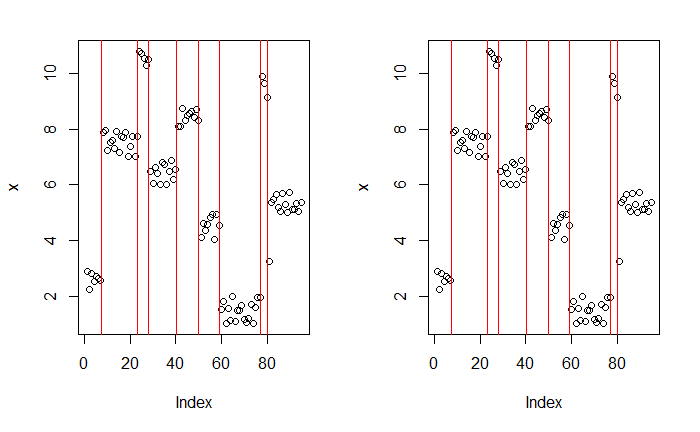
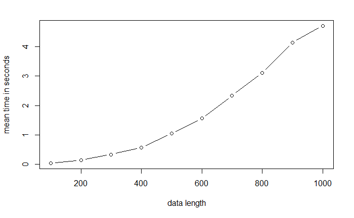
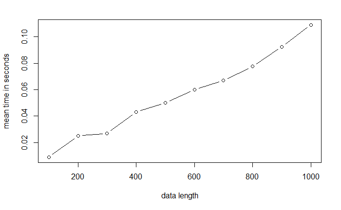

# Project_Algorithms
## Topic : Ruptures detection Algorithms

### Group 8

#### Data Science, Evry Paris-Saclay University

##### December 12, 2020
> [Introduction](#qs)

> [The 2 algorithms](#com)

> [Package installation](#pac)

> [Time complexity Comparaison](#time)

<a id="qs"></a>

# Introduction : 

As increasingly longer data sets are being collected, more and more applications require the detection of changes in the distributional properties of such data.
Typically the time series in finance, will contain several changepoints.
There is therefore a growing need to be able to search for such changes efficiently. It
is this search problem which we consider in this project.

Details on the Ruptures detection can be found on [its wikipedia page](https://fr.wikipedia.org/wiki/Détection_de_ruptures). This image provides a graphical representation of its mechanisms.
### Exemple de signal ayant des changements dans la moyenne.



<a id="pac"></a>

# Package installation :
You first need to install the devtools package, it can be done easily from Rstudio. We install the package from Github :

devtools::install_github("tungle92/Project_Algorithms")

library(Algo)

<a id="com"></a>

# The 2 algorithms

### Optimal Partitioning (OP) : 

Roughly speaking, it computes the cost of all subsequences of a given signal. The number of computed costs is of the order O(Kn2), where K is the number of change points and n the number of samples. This has to be multiplied by the computational cost of computing the approximation error on one sub-sequence. Consequently, piecewise constant models are significantly faster than linear or autoregressive models.

### Pruned Exact Linear Times (PELT) : 

Because the enumeration of all possible partitions impossible, the algorithm relies on a pruning rule. Many indexes are discarded, greatly reducing the computational cost while retaining the ability to find the optimal segmentation. In addition, under certain conditions on the change point repartition, the computational complexity is linear on average.


### A first simple test :

We take x as simple vector,and the penalitie parameter equal 0.1.

``` r
x=c(1,1,2,2,3,3,4,4,5,5)
beta = 0.1

```


We've implemeted 2 algorithms :

-   `OP`
-   `PELT`

They all have two arguments: the initial seris vector data `x` and `beta`.

```{r}
graph_cp <- function(x, cps){
  plot(x)
  abline(v=cps+0.1, col='red')
}
x=c(1,1,2,2,3,3,4,4,5,5)

cps = OP(x, beta = 0.1)
cps1 = PELT(x, beta = 0.1)
par(mfrow=c(1,2))
graph_cp(x, cps)
graph_cp(x, cps1)
```
 
We found this graphs when OP and PELT are exécute on `x` and `beta` values 



<a id="time"></a>

# Time complexity Comparaison :

### a) Ones simulation function :
```{r}
one.simu <- function(n, type = "sample", algo)
{
  m = sample(n/10)
  if(type == "sample"){v <- sample(m)}else{v <- m:1}
  w = sample(m)
  x=rep(v,w*n/sum(w))+runif(length(rep(v,w*n/sum(w))))
  if (algo == 'OP'){
    t <- system.time(OP(x, 1))[[1]]
  }
  else if (algo == 'PELT'){
    t <- system.time(PELT(x, 1))[[1]]
  }
  return(t)
}
```
```{r}
one.simu(100, algo = 'OP')
```
  ##### [1] 0.12

```{r}
one.simu(100, algo = 'PELT')
```
  ##### [1] 0.02


### b) OP Time complexity graph :

```{r}
nbSimus <- 10
vector_n <- seq(from = 100, to = 1000, length.out = nbSimus)
nbRep <- 2
res_cp <- data.frame(matrix(0, nbSimus, nbRep + 1))
colnames(res_cp) <- c("n", paste0("Rep",1:nbRep))

j <- 1
for(i in vector_n)
{
  res_cp[j,] <- c(i, replicate(nbRep, one.simu(i, algo = 'op')))  
  j <- j + 1
}

res <- rowMeans(res_cp[,-1])
plot(vector_n, res, type = 'b', xlab = "data length", ylab = "mean time in seconds")
```



### c) PELT Time complexity graph : 

```{r}
nbSimus <- 10
vector_n <- seq(from = 100, to = 1000, length.out = nbSimus)
nbRep <- 2
res_cp <- data.frame(matrix(0, nbSimus, nbRep + 1))
colnames(res_cp) <- c("n", paste0("Rep",1:nbRep))

j <- 1
for(i in vector_n)
{
  res_cp[j,] <- c(i, replicate(nbRep, one.simu(i, algo = 'PELT')))  
  j <- j + 1
}

res <- rowMeans(res_cp[,-1])
plot(vector_n, res, type = 'b', xlab = "data length", ylab = "mean time in seconds")
```


