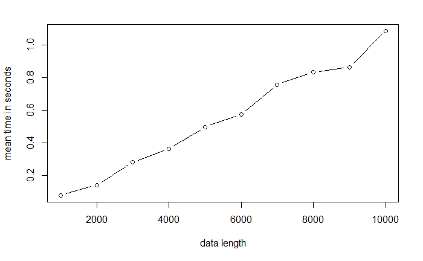
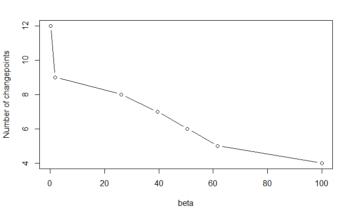

# Project_Algorithms
## Topic : Changepoints detection Algorithms

### Group 8

#### Data Science, Evry Paris-Saclay University

##### December 12, 2020
> [Introduction](#qs)

> [The 2 algorithms](#com)

> [Package installation](#pac)

> [Time complexity Comparaison](#time)

> [Penalty value](#beta)

> [CROPS Algorithm](#CROPS)

> [References](#ref)

<a id="qs"></a>

# Introduction : 

The `Changepoint` is a R package developed for the detection of changepoints as a project of the **algorithmic M2 courses in Data Science master's program at Evry Paris-Saclay University**. This package includes two algorithms: **Optimal Partitioning (OP)** and **Pruned Exact Linear Times (PELT)** implemented in R and Rcpp.

Details on the detection of changepoints can be found on [its wikipedia page](https://fr.wikipedia.org/wiki/Détection_de_ruptures). This image provides a graphical representation of its mechanisms.
### Example of changes in Mean.


<a id="pac"></a>
### Example of Changes in Auto-covariance within AR.


# Package installation :
You first need to install the devtools package, it can be done easily from Rstudio. We install the package from Github :

**devtools::install_github("tungle92/Project_Algorithms")**

**library(Changepoints)**

<a id="com"></a>

# The 2 algorithms

### Optimal Partitioning (OP) : 

This algorithm computes the cost of all subsequences of a given data. The number of computed costs is of the order O(n2). This has to be multiplied by the computational cost of computing the approximation error on one sub-sequence.

### Pruned Exact Linear Times (PELT) : 

The algorithm relies on a pruning rule. Many indexes are discarded, greatly reducing the computational cost while retaining the ability to find the optimal segmentation. In addition, under certain conditions of the changepoint repartition,  on average, the computational complexity is linear.


### A first simple test :

We take x as simple vector,and the penalty parameter `beta` equals 0.1.
We've implemeted 2 algorithms :

-   `OP`
-   `PELT`

They all have two arguments: the initial vector data `x` and `beta`.

```{r}
graph_cp <- function(x, cps){
  plot(x)
  abline(v=cps+0.1, col='red')
}
n=100
m = sample(n/10)
v <- sample(m)
w = sample(m)
x = rep(v,w*n/sum(w))+runif(length(rep(v,w*n/sum(w))))

cps = OP(x, beta = 0.1)$cps
cps1 = PELT(x, beta = 0.1)$cps
par(mfrow=c(1,2))
graph_cp(x, cps)
graph_cp(x, cps1)
```
 
We obtain the following result given `x` and `beta` above


<a id="time"></a>

# Time complexity Comparison :

### a) Simulation function : at least 30 observations between changepoints
```{r}
mean.simu(n, m) #change in mean with n observations, m changepoints
var.simu(n, m) #change in variance with n observations, m changepoints
```

### b) OP Time complexity graph:

```{r}
set.seed(1)
nbSimus <- 10
vector_n <- seq(from = 100, to = 1000, length.out = nbSimus)
nbRep <- 10
res_cp <- data.frame(matrix(0, nbSimus, nbRep + 1))
colnames(res_cp) <- c("n", paste0("Rep",1:nbRep))

j <- 1
for(i in vector_n)
{
  res_cp[j,] <- c(i, replicate(nbRep, system.time(OP(mean.simu(i,i/100)$x, beta = 1, 'mean'))[[1]]))  
  j <- j + 1
}

res <- rowMeans(res_cp[,-1])
plot(vector_n, res, type = 'b', xlab = "data length", ylab = "mean time in seconds")
```

```
Call:
lm(formula = log(res) ~ log(vector_n))

Coefficients:
  (Intercept)  log(vector_n)  
      -12.958          2.116  
```
### c) PELT Time complexity graph: 

```{r}
set.seed(1)
nbSimus <- 10
vector_n <- seq(from = 1000, to = 10000, length.out = nbSimus)
nbRep <- 10
res_cp <- data.frame(matrix(0, nbSimus, nbRep + 1))
colnames(res_cp) <- c("n", paste0("Rep",1:nbRep))

j <- 1
for(i in vector_n)
{
  res_cp[j,] <- c(i, replicate(nbRep, system.time(PELT_rcpp(mean.simu(i,i/100)$x, beta = 1, 'mean'))[[1]]))  
  j <- j + 1
}

res <- rowMeans(res_cp[,-1])
plot(vector_n, res, type = 'b', xlab = "data length", ylab = "mean time in seconds")
```


```
Call:
lm(formula = log(res) ~ log(vector_n))

Coefficients:
  (Intercept)  log(vector_n)  
      -10.613          1.121
```
When the number of changepoints increases at a slow rate:

### Square root increasing number of changepoints (m = n^0.5/4)
The cost of computation PELT is no longer linear.

```
Call:
lm(formula = log(res) ~ log(vector_n))

Coefficients:
  (Intercept)  log(vector_n)  
       -16.06           1.60
```
### Fixed number of changepoints (m = 2)

```
Call:
lm(formula = log(res) ~ log(vector_n))

Coefficients:
  (Intercept)  log(vector_n)  
      -17.512          1.881
```
<a id="beta"></a>
# Different beta
Try with different number of observations n (1000, 5000, 10000, 50000), with a linearly increasing number of changepoints m=n/100 for the problem change in mean. We consider here three value of beta: sigma^2, 2*sigma^2*log(n) and sigma^2*log(n).* (sigma is obtained by Hall's variance estimation of order 3)

Simulate 10 times for each n and calculate the ratio of number of true detections and false detections over number of real changepoints m.

Beta = sigma^2 has the highest true detection ratio, but there are too many false detections (30 times the real number). 

Beta = 2*sigma^2*log(n) can be considered the best among three beta's values above with the lowest false detection ratio and acceptable true detection ratio. 


<a id="CROPS"></a>
# CROPS Algorithm
```{r}
set.seed(1)
n= 1000
m = 10
v <- sample(m)/2
w = sample(m)
x = rep(v,w*n/sum(w))
u = rnorm(length(rep(v,w*n/sum(w))))/10
x = x+ u

CROPS = CROPS(x, c(0.07,100), 'mean')
CROPS
```
$beta
[1]   0.0700000   0.0766513   0.0766513   1.8529799  26.2004565  39.4520287  50.5479331
[8]  61.6438375 100.0000000

$ncp
[1] 12 12 12  9  8  7  6  5  4


```{r}
cps1 = PELT_rcpp(x, CROPS$beta[3], 'mean')
n1=length(cps1$cps)
cps2 = PELT_rcpp(x, CROPS$beta[4], 'mean')
n2=length(cps2$cps)
beta_int = (cps1$Q-cps2$Q-n1*CROPS$beta[3]+n2*CROPS$beta[4])/(n2-n1)
beta_int ==  CROPS$beta[3]
```
[1] TRUE
<a id="ref"></a>
# References
Killick, R., Fearnhead, P. and Eckley, I.A., *Optimal detection of changepoints with a linear computational cost*. Journal of the American Statistical Association, 107(500), 1590-1598.
